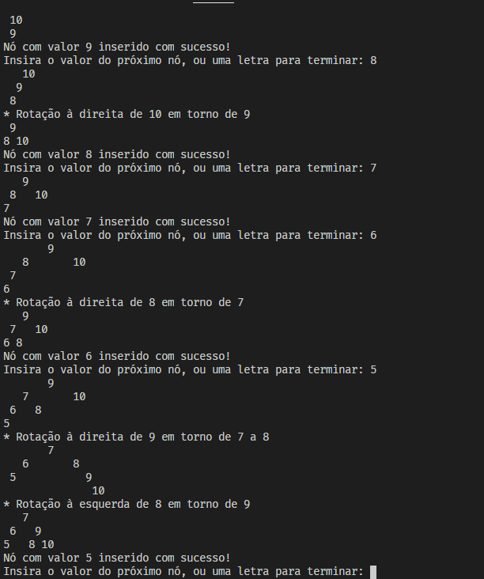

# Árvore AVL
Uma árvore AVL é uma estrutura de dados organizada para busca binária, onde nenhum dos nós apresenta um desequilíbrio entre seus descendentes à direita e à esquerda maior do que 1 nível. Tal balanceamento garante um melhor desempenho do algoritmo de busca dos dados.

Esta implementação verifica o equilíbrio dos nós a cada inserção de nó folha pelo usuário, balanceando a estrutura sempre que necessário. As operações de balanceamento, bem como a estrutura resultante, são descritas no terminal para fins didáticos.



Para compilar no GCC:

```gcc -Wall main.c arvore.c lista.c -o teste```